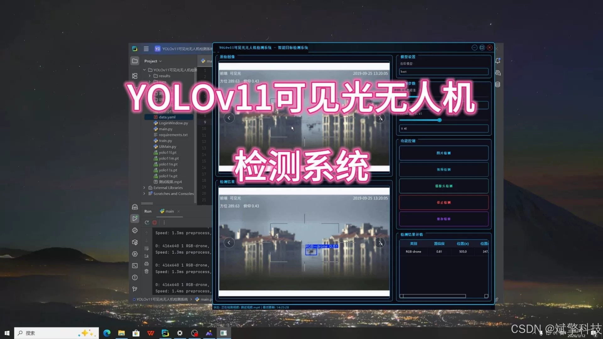
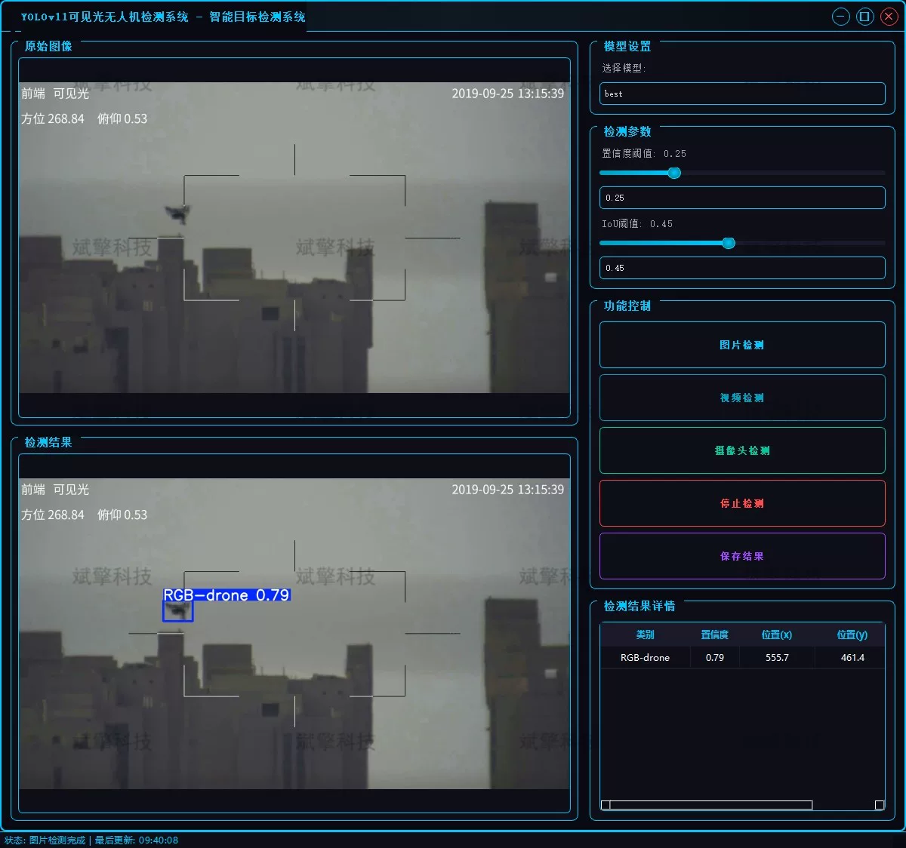
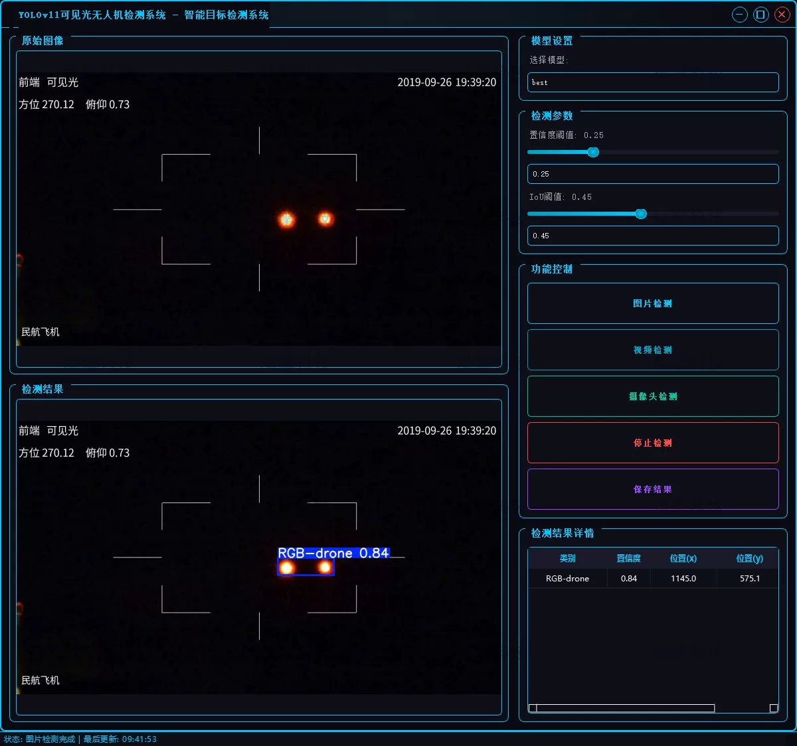
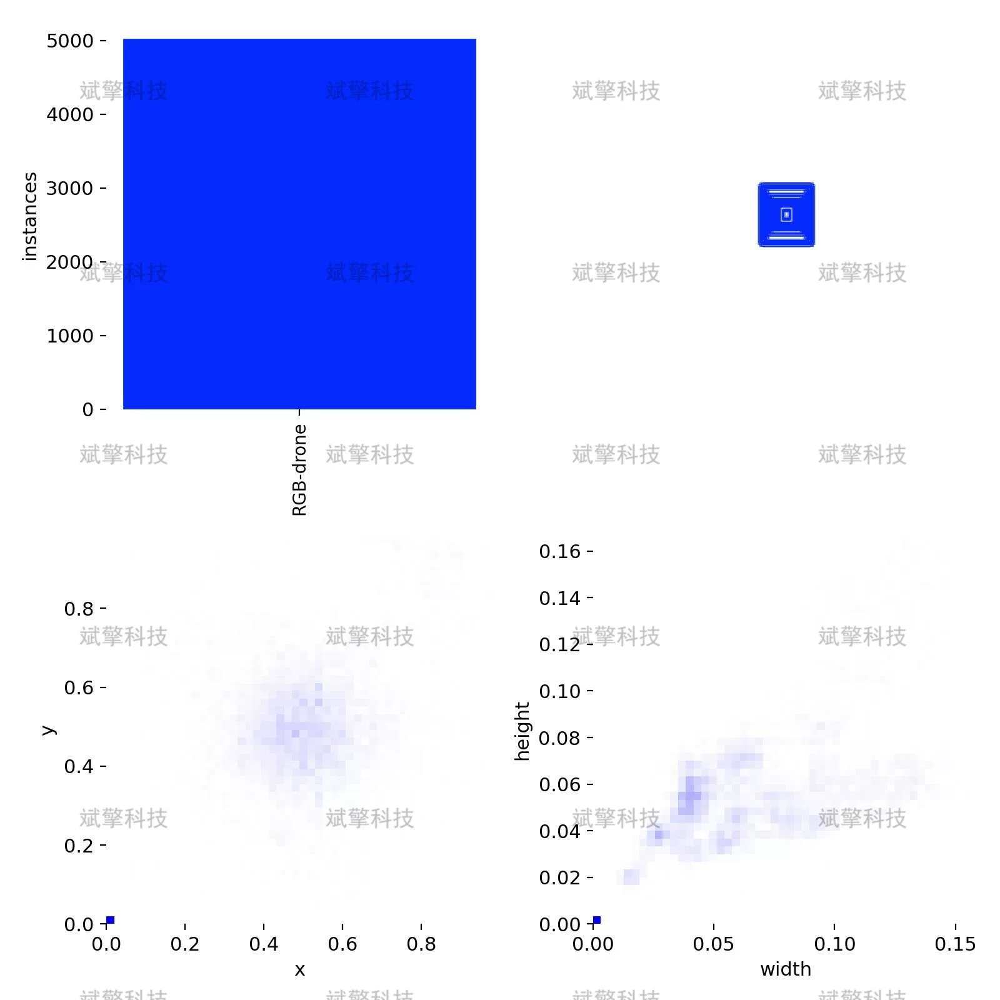
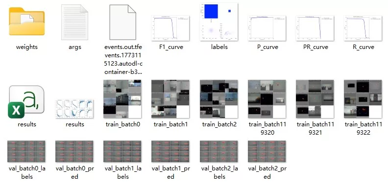
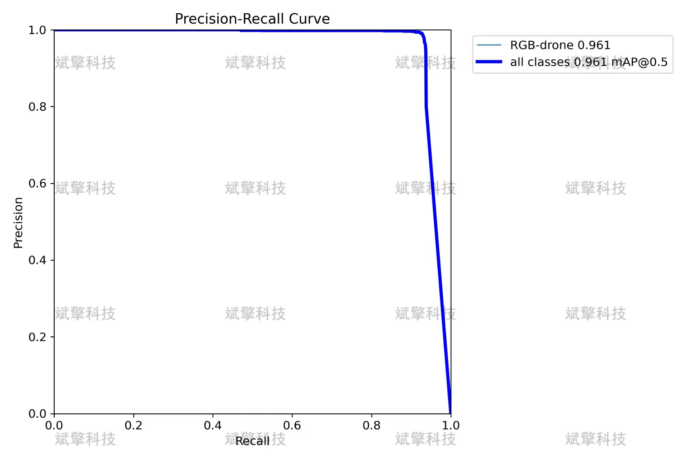
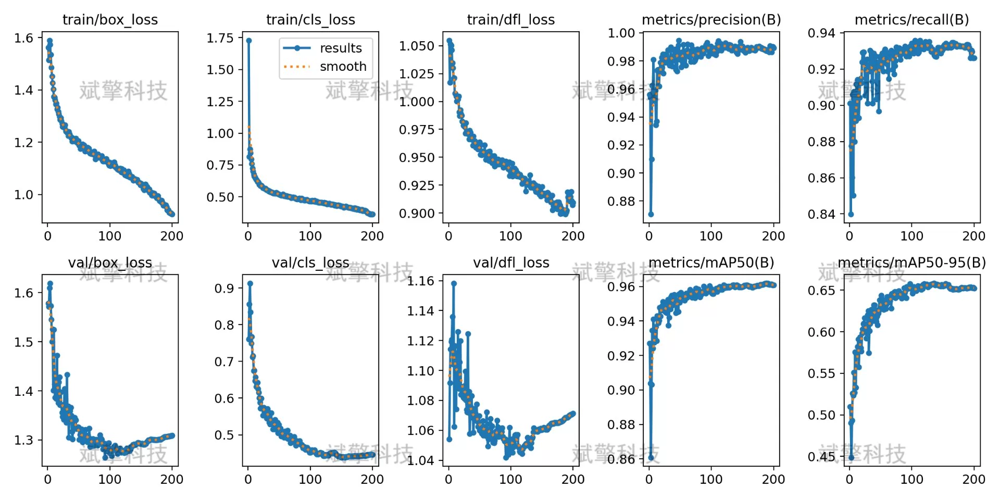
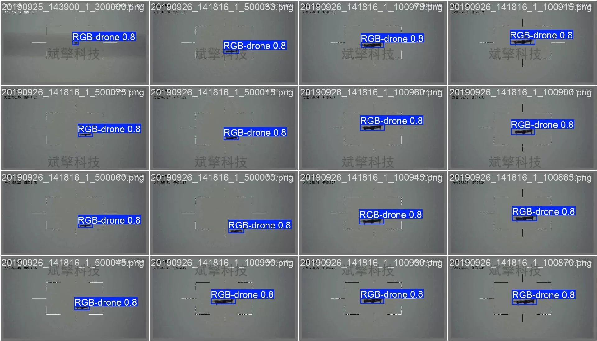

# YOLOv11 Drone Detection System

## Body

YOLOv11 Drone Detection System, based on the latest YOLOv11 deep learning framework, designed and implemented a highly efficient and precise visible light drone detection system.

With the rapid development of low-altitude economy and the widespread application of drones, the disorderly flight of "low, slow, and small" targets poses severe challenges to public safety, privacy protection, and security in key areas. In response to the detection difficulty of drone targets in complex backgrounds due to their small size, random movement, and easy confusion with birds and other objects, this system is based on the latest YOLOv11 deep learning framework and has been designed and implemented to achieve real-time recognition and localization of airborne drone targets.

The system supports three detection modes: images, videos, and real-time cameras, with good robustness and practicality, providing an intelligent technical solution for low-altitude security.

Project Functionality Display

✅ User Login and Registration: Supports password verification and security validation.

✅ Three Detection Modes: Based on the YOLOv11 model, supports image, video, and real-time camera detection, accurately recognizing targets.

✅ Dual Screen Comparison: Displays the original scene and detection results on the same screen.

✅ Data Visualization: Real-time table displays the category, confidence, and coordinates of detected targets.

✅ Intelligent Parameter Tuning: Offers a confidence slide bar to dynamically optimize detection accuracy, adapting to different scene needs.

✅ Sci-Fi Interactive Interface: Dark theme combined with dynamic light effects, reducing visual fatigue and improving operational experience.

✅ Multi-thread High-Performance Architecture: Independent detection thread ensures smooth operation, real-time status prompts, and fast response without lag.

Dataset Introduction

Training Set (Training Set): 5019 images
Validation Set (Validation Set): 1233 images

## Images

## Payment

Here is a pay link on Stripe ( https://buy.stripe.com/3cs8yP7sY87d0vu9AB ). Please contact me lonlonago@foxmail.com after funding $89, and I will send you a complete data files , thank you!

